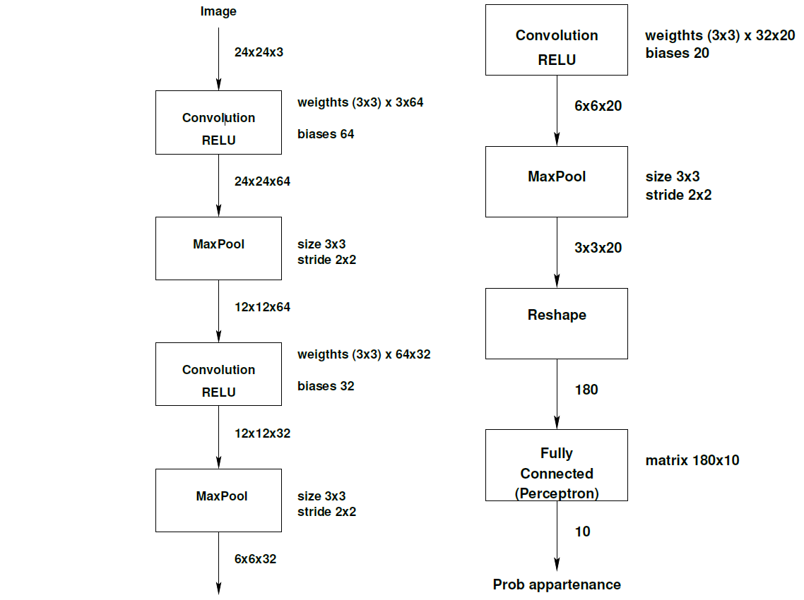
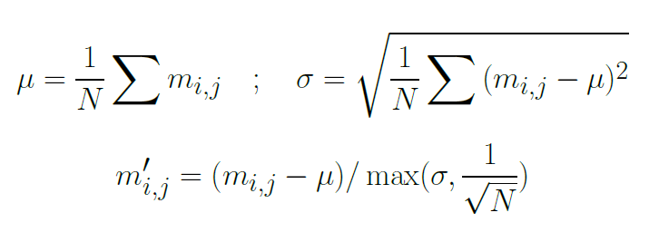
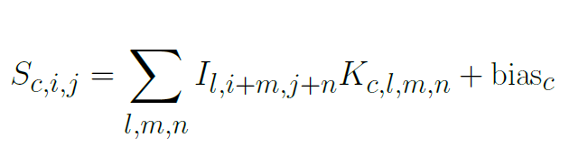
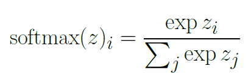

`Under Construction...`

# About:
This project is an implementation of a basic CNN (Convolutional Neural Network) using python. The network is already trained using CIFAR-10 dataset, and the training step is beyond the scope of this project. 

The architectural view of the network is described in the figure bellow.

As shown above the network is taking a an RGB image with 32x32 dimension and outputs class of the identified object in the image, 1 to 10, each number is corresponding to a label (airplane; automobile ;bird; cat etc. ).

## Technical Aspects:
- The data files that are needed for this project are located under `project_data` and can be described as the following:
    - `CNN_weigthts_3x3.txt`: which stores the convolution witghts and biases.
    - `test_batch.bin`: the test set of a 10000 image in a binary format. Each image is stored as the following:
        - The first byte is the label of the first image, which is a number in the range 0-9.
        - The next 3072 bytes are the values of the pixels of the image:
            - **First 1024 bytes** are the **red** channel values;
            - **Next 1024 bytes** are the **green** channel values; and
            - **Final 1024 bytes** are the **blue**  channel values.

- Some of the mathematical formulas:

    - Image normalization formula:
        

            
        

    
    - The convolution formula:
        

            
        

        
    - Softmax formula:
            

                
            

    
### Note: 
- 

## Overview:
### Project State: 
- The CNN implementation is outputing the expected results.

### To-Do List: 
- Add 'debug' capabilities to output intermediate results between CNN layers. 

## Mini User Guide:
### Pre-requirements:
- Python (used version: *3.12.1*)
- Installed Numpy and Matplotlib python libraries

### How to use:
- The main script to be run is: `src/main.py`, 
    - Can be run simply by running: `python src/main.py`
    - Can take two args: 
        - `--data_dir path/to/project_data` *(optional)*: the path to the dir that contains the needed *coeffs* and the *test data set*. By default if not specified, the path to project_data is: `./project_data/`.
        - `--image_item num` *(optional)*: how many image to iterate in the test data set, by default if not specified the number is `10`.
- Example: `python .\src\main.py --data_dir ./project_data --image_iter 200`
    

## Project Structure: 
    .
    ├── doc
    │   ├── cnn_schema.png
    │   ├── conv_formula.png
    │   ├── normalize_formula.png
    │   └── softmax_formula.png
    ├── project_data
    │   ├── batches.meta.txt
    │   ├── CNN_coeffs_3x3.txt
    │   └── test_batch.bin
    ├── README.md
    └── src
        ├── convolutions.py
        ├── extracting_coeffs.py
        ├── images_processing.py
        ├── main.py
        ├── maxpooling.py
        ├── network_tests.py
        └── reshape_perceptron_sfmax.py

## Contacts:
- abderrahimelhamzi.dev@gmail.com

